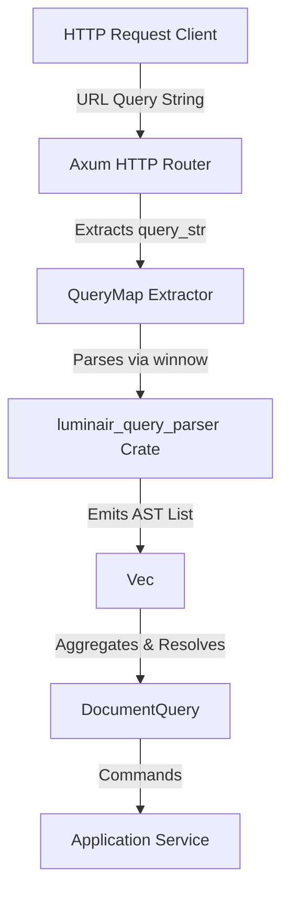

# Query Parsing Architecture & Realization Plan (Winnow Variant)

This document outlines the design, grammar specification, and realization plan for refactoring the HTTP query parameter parsing layer using the **`winnow`** parser combinator library. This plan is scheduled for implementation in the **post-MVP phase**.

---

## 1. Objectives

- **Type Safety**: Replace the intermediate `serde_json::Map<String, Value>` parsing step with a direct compilation of query string parameters into a typed Abstract Syntax Tree (AST).
- **Strict Validation**: Rejects syntax errors at the API boundary, generating descriptive client errors instead of silently discarding malformed query keys.
- **Performance**: Leverage zero-copy parsing using standard Rust slices and avoid intermediate JSON allocations.
- **Modularity**: Isolate query parsing logic into a separate, easily testable library crate.

---

## 2. Proposed Architecture

We will introduce a new crate `luminair_query_parser` in the workspace.



### Components

1. **`luminair_query_parser` (New Crate)**:
   - **`ast.rs`**: Holds AST representation of parsed filter expressions, pagination parameters, population rules, and sorts.
   - **`parser.rs`**: Contains pure `winnow` combinators for parsing individual query parameter keys and values.
   - **`aggregator.rs`**: Collects the stream of parsed parameters and aggregates them into a structured `RawQueryParams` representation.
2. **`luminair_service` (HTTP Adapter)**:
   - Utilizes the parser in the Axum custom extractor and resolves the raw AST against the `DocumentType` schema.

---

## 3. Query Grammar Specification

Since query parameters separated by `&` are order-independent, the grammar parses **individual key-value pairs**, which are then aggregated.

### EBNF Grammar

```ebnf
QueryParam       ::= PopulateParam | PaginationParam | SortParam | FilterParam | StatusParam

PopulateParam    ::= "populate" ("[]" | "[" AttributeId "]")? "=" AttributeId
PaginationParam  ::= "pagination" "[" ("page" | "pageSize") "]" "=" Integer
SortParam        ::= "sort" ("[]" | "[" Integer "]")? "=" AttributeId ":" SortDirection
StatusParam      ::= "status" "=" ("draft" | "published")

FilterParam      ::= "filters" "[" AttributeId "]" ( "[" (Operator | AttributeId) "]" )* "=" Value

Operator         ::= "$eq" | "$ne" | "$gt" | "$gte" | "$lt" | "$lte" | "$in" | "$notIn" | "$contains" | "$startsWith" | "$endsWith" | "$null" | "$notNull"
AttributeId      ::= [a-zA-Z_] [a-zA-Z0-9_-]*
SortDirection    ::= "asc" | "desc"
Integer          ::= [0-9]+
Value            ::= [^&]*
```

---

## 4. AST Definitions

```rust
pub enum QueryParam {
    Populate(String),
    Pagination(PaginationRule),
    Sort(SortRule),
    Status(DocumentStatusRule),
    Filter(FilterNode),
}

pub enum PaginationRule {
    Page(u16),
    PageSize(u16),
}

pub struct SortRule {
    pub field: String,
    pub direction: SortDirection,
}

pub enum SortDirection {
    Ascending,
    Descending,
}

pub enum DocumentStatusRule {
    Draft,
    Published,
}

pub enum FilterNode {
    /// E.g. filters[title][$eq]=hello
    Condition {
        field: String,
        operator: Option<String>,
        value: String,
    },
    /// E.g. filters[author][name][$contains]=dmitri
    Nested {
        relation: String,
        child: Box<FilterNode>,
    },
}
```

---

## 5. Winnow Parser Realization Sketch

Below is an implementation prototype showing how `winnow` combinators parse complex bracketed keys.

```rust
use winnow::prelude::*;
use winnow::ascii::{alphanumeric1, dec_uint};
use winnow::combinator::{alt, delimited, opt, repeat, seq};

/// Parse a nested filter key: "filters[author][name][$eq]"
/// Returns: (relation_path: Vec<String>, leaf_field: String, operator: Option<String>)
fn parse_filter_key(input: &mut &str) -> PResult<(Vec<String>, String, Option<String>)> {
    let _ = "filters".parse_next(input)?;
    
    // Parse nested brackets (at least one)
    let mut segments: Vec<String> = repeat(1.., delimited('[', parse_segment, ']')).parse_next(input)?;
    
    // The last segment could be an operator like "$eq" or a leaf field
    let mut operator = None;
    if let Some(last) = segments.last() {
        if last.starts_with('$') {
            operator = segments.pop();
        }
    }
    
    let leaf_field = segments.pop().ok_or_else(|| {
        winnow::error::ErrMode::Backtrack(winnow::error::ContextError::new())
    })?;
    
    Ok((segments, leaf_field, operator))
}

fn parse_segment(input: &mut &str) -> PResult<String> {
    // Allows alphanumeric, hyphens, underscores and prefix $ for operators
    let chars = winnow::token::take_while(1.., |c: char| {
        c.is_alphanumeric() || c == '_' || c == '-' || c == '$'
    }).parse_next(input)?;
    Ok(chars.to_string())
}
```

---

## 6. Implementation and Migration Plan

### Phase 1: Setup & AST Definition
1. Create a new crate `src/query_parser` in the workspace.
2. Define the AST structures (`ast.rs`) and error representations.
3. Add `winnow` as a dependency in the workspace `Cargo.toml`.

### Phase 2: Combinator Implementation
1. Write specific parsers in `src/query_parser/parser.rs` for:
   * Populate formats
   * Pagination brackets
   * Sort formats (field and direction parsing)
   * Filter paths (nested segments, operators, array syntax)
2. Add comprehensive unit tests verifying success paths and boundary edge-cases (unbalanced brackets, invalid operators, empty keys).

### Phase 3: Aggregator Development
1. Write the `RawQueryParams` aggregator in `src/query_parser/aggregator.rs`.
2. Ensure it handles array pushes correctly (e.g. `filters[tags][$in][]=rust&filters[tags][$in][]=axum`).
3. Add tests verifying sorting order integrity and handling of duplicates.

### Phase 4: Service Integration
1. Replace [`src/service/src/infrastructure/http/querystring.rs`](file:///Users/dmitri.astafiev/luminair/luminair-service/src/service/src/infrastructure/http/querystring.rs) with the new `luminair_query_parser` crate invocation.
2. Refactor [`params.rs`](file:///Users/dmitri.astafiev/luminair/luminair-service/src/service/src/infrastructure/http/handlers/content/params.rs) to accept the parsed AST directly and map it into the domain-validated `DocumentQuery` structure.
3. Verify that integration/controller tests still pass seamlessly.

### Phase 5: Verification & Benchmarks
1. Run local benchmarks comparing the original string slice regex-like search to the new `winnow` parser to check allocation overhead.
2. Format and verify with `cargo fmt --all --check` and `cargo test --workspace`.
